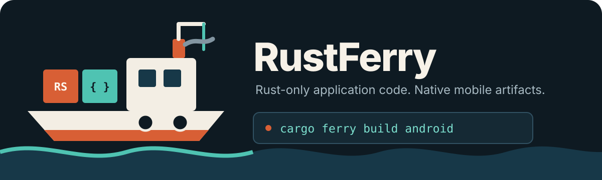
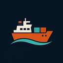

<p align="center">
  
</p>

<h1 align="center">RustFerry</h1>

<p align="center">
  Build Rust-only mobile apps for Android and iOS—without maintaining Gradle or Xcode projects.
</p>

<p align="center">
  <a href="https://github.com/ShiroKSH/rustferry/actions/workflows/ci.yml"></a>
  <a href="https://github.com/ShiroKSH/rustferry/actions/workflows/platform-artifacts.yml"></a>
  <a href="https://github.com/ShiroKSH/rustferry/actions/workflows/vscode-extension.yml"></a>
  <a href="https://marketplace.visualstudio.com/items?itemName=ShiroKSH.rustferry-vscode"></a>
  <a href="#license"></a>
  <a href="https://www.rust-lang.org/tools/install"></a>
</p>

RustFerry keeps application code and assets in an ordinary Rust project. When you build, it creates the required platform host below `target/ferry/`; that generated glue is disposable and stays out of your source tree.

> [!IMPORTANT]
> RustFerry is a source beta / developer preview. The Android APK pipeline is artifact-validated on a GitHub-hosted Ubuntu runner; the accepted build used local-workspace path runtime mode. The user-owned application project remains Rust-only and requires neither Gradle nor an Android Studio project. Installation, launch, and runtime behavior were not validated. Durable remote jobs, sanitized logs, cancellation, retry, managed artifacts, and explicit public GitHub snapshots have focused Windows-native coverage, but no current-revision local Windows APK or Windows-originated GitHub/macOS iPhone acceptance is claimed. The live-proven iPhone result remains an unsigned physical-iPhone XCArchive; no development-signed IPA or device runtime is claimed. See the [support matrix](docs/support-matrix.md), [implementation evidence](docs/STATUS.md), and [Goal 3 evidence log](docs/GOAL3_STATUS.md).

## What it does

- Generates Rust application projects from small, capability-aware templates.
- Builds Android APKs directly with Cargo, the NDK, `aapt2`, `d8`, `zipalign`, and `apksigner`; no Gradle project to maintain.
- Generates an Apple host under `target/ferry/` and invokes Xcode tooling for iOS Simulator builds; no Xcode project in application source.
- Sends an exact physical-iPhone build request from Linux or Windows to a trusted GitHub-hosted macOS worker, then independently validates the downloaded artifact.
- Persists private project-bound remote jobs across CLI/IDE restarts with sanitized logs, exact cancellation/retry, managed artifacts, and crash-safe pruning.
- Submits an explicit dirty project as a consent-bound public GitHub snapshot without switching the caller branch, staging the index, or running hooks.
- Discovers devices and composes artifact-validated builds with typed install and launch operations through ADB, simctl, and devicectl, with bounded application-filtered logs.
- Provides a native, trust-aware Visual Studio Code extension driven by a stable versioned JSON/NDJSON protocol.
- Generates deterministic Android density assets plus tested iOS compiled-catalog and SDK-only resources from validated opaque PNG sources.
- Exposes typed APIs for lifecycle events, network state, storage, permissions, haptics, clipboard, sharing, deep links, local notifications, widgets, and Live Activities.
- Keeps host-side behavior testable with a deterministic runtime.

Capability availability and validation depth differ by platform. An API or generated bridge is not, by itself, proof of runtime behavior.

## Install from source

RustFerry is not published to crates.io yet. Install the CLI from a checkout and select the local runtime explicitly:

```console
git clone https://github.com/ShiroKSH/rustferry.git
cd rustferry
cargo install --locked --path crates/cargo-ferry
cargo ferry new weather \
  --runtime-source path \
  --runtime-path "$PWD/crates/rustferry"
```

`--runtime-source workspace` supports monorepo development. `CARGO_FERRY_RUNTIME_PATH` remains an optional contributor-only development override when no explicit source is supplied; normal published installations do not require it. Rust 1.92 or newer is required. Local Android builds need the Android SDK/NDK, and local Apple builds need full Xcode. A Linux or Windows client using a configured remote physical-iPhone provider needs neither local Xcode nor an Apple SDK.

After the coordinated crates are published, the normal installation will be `cargo install cargo-ferry`.

Registry-based starter generation remains unavailable until the internal RustFerry crates are published. This source beta therefore uses the reviewed checkout or local-workspace path runtime mode; it is not a crates.io release.

## Create a project

```console
cargo ferry new weather --id com.example.weather
cd weather
cargo ferry check
```

The generated application remains a normal Rust project:

```text
weather/
├── Cargo.toml
├── ferry.toml
├── assets/
└── src/

weather/target/ferry/   # generated Android and Apple hosts
```

Inspect prerequisites and available capabilities before a platform build:

```console
cargo ferry doctor --all
cargo ferry capabilities
```

## Build

Build a signed Android APK without a Gradle project:

```console
cargo ferry build android
```

On macOS, build an arm64 iOS Simulator application:

```console
cargo ferry build ios --simulator
```

Build for a physical iPhone with official development signing:

```console
cargo ferry signing teams
cargo ferry build ios --device --team ABCDE12345
```

From Linux or Windows, configure the GitHub provider and request an unsigned physical-iPhone
archive without installing Xcode locally:

```console
cargo ferry remote setup github \
  --source-remote-name public \
  --execution-remote-name signing \
  --execution-repository OWNER/private-signing \
  --worker-revision <exact-commit>
cargo ferry build iphone --remote github --unsigned
```

An explicit dirty-source build is unsigned-only and uses a public GitSnapshot:

```console
cargo ferry --dry-run build iphone --remote github --snapshot --unsigned
cargo ferry build iphone --remote github --snapshot --unsigned
```

Review the interactive `[y/N]` plan; JSON/non-interactive execution requires `--yes`. Source bytes enter the public Git object database. Temporary-ref deletion is cleanup, not erasure, and the retained local snapshot remains available for exact retry until explicit lineage pruning.

On Linux and Windows, omitting `--remote` from a physical-iPhone build selects GitHub. Named SSH
endpoints are never selected implicitly; pass their configured name explicitly. On macOS,
`cargo ferry build ios --device` remains a local build unless a remote is requested (or unsigned
remote mode is selected).

Development signing additionally requires the protected private-repository setup and Apple assets
described in [GitHub provider security](docs/remote/github-security.md). An app with Widget and Live
Activity targets supplies one exact profile per generated target:

```console
cargo ferry signing setup manual \
  --certificate /private/signing/development.p12 \
  --profile weather=/private/signing/application.mobileprovision \
  --profile FerryWidgetExtension=/private/signing/widget.mobileprovision \
  --profile FerryLiveActivityExtension=/private/signing/live-activity.mobileprovision \
  --remote github \
  --device-sha256 <lowercase-sha256> \
  --dry-run
```

The exact target names come from the generated signing plan. At most three profiles are accepted and
they must share the selected device. The legacy unkeyed profile path remains available for a
single-application project. The generated workflow and worker bind the complete application,
extension, framework, and dynamic-library target graph through a canonical SHA-256. Multi-profile
setup and transport pass the affected-package integration suite locally. The unsigned remote path
has live compile/download evidence; protected secret upload and real signed IPA export have not run.

## Remote jobs and artifacts

```console
cargo ferry jobs list
cargo ferry jobs show <local-job-id>
cargo ferry jobs logs <local-job-id> --follow
cargo ferry jobs cancel <local-job-id>
cargo ferry jobs retry <local-job-id>
cargo ferry jobs artifacts <local-job-id>
cargo ferry artifact verify <downloaded-path> --job <local-job-id>
```

Job records contain typed secret-free checkpoints, not tokens or raw provider payloads. Exact retry reuses the stored Git revision or retained GitSnapshot; `--use-current-source --yes` is a separate consent-bound recapture. Local artifact removal is distinct from GitHub Actions retention.

For a dedicated Mac, add a pinned SSH endpoint and request the locally tested unsigned snapshot
path:

```console
cargo ferry remote add ssh-mac production-mac \
  --host build.example.com \
  --user ferry \
  --known-hosts /absolute/path/rustferry.known_hosts \
  --host-key-sha256 SHA256:BASE64_WITHOUT_PADDING
cargo ferry remote doctor production-mac
cargo ferry build iphone --remote production-mac --unsigned
```

SSH snapshot v1 returns an independently verified unsigned XCArchive ZIP. No live SSH Mac build has
been recorded, and this path does not sign, export an IPA, install, launch, or prove device runtime.

Build never touches a device. Deployment is explicit:

```console
cargo ferry devices
cargo ferry install android --device SERIAL
cargo ferry run ios --simulator SIMULATOR_UDID
cargo ferry logs android --device SERIAL
```

Deployment backends are implemented and deterministically tested, but emulator, Simulator, and physical-device runtime validation remains pending.

## Visual Studio Code

<a href="https://marketplace.visualstudio.com/items?itemName=ShiroKSH.rustferry-vscode">
  
</a>

Install [RustFerry for VS Code](https://marketplace.visualstudio.com/items?itemName=ShiroKSH.rustferry-vscode) from the Visual Studio Marketplace, or build and install the packaged extension from source:

```console
cd editors/vscode
npm ci
npm run package
code --install-extension dist/rustferry-vscode.vsix
```

After the coordinated crates are published, the normal editor flow is:

```console
cargo ferry new weather
code weather
```

In the opened workspace, run **RustFerry: Doctor**, then **RustFerry: Build Android**. The extension discovers trusted `ferry.toml` workspaces and exposes project/device/artifact/job trees, diagnostics, remote snapshot preview/consent, cancellation, retry, sanitized job logs, signing readiness, Check, Install, Run, Logs, capability changes, and a native Create Project wizard. It delegates build, job, artifact, and deployment logic to `cargo-ferry` protocol v1.

## Add capabilities

```console
cargo ferry add notifications
cargo ferry add widget
cargo ferry config validate
```

Configuration lives in `ferry.toml`. Generated platform files remain under `target/ferry/`; application business logic stays in Rust.

## Examples

- [Counter](examples/counter/README.md): persistence and lifecycle events.
- [Network Guard](examples/network-guard/README.md): offline UI, required-online gates, and endpoint probes.
- [Notifications](examples/notifications/README.md): permission, delivery, scheduling, cancellation, and opens.
- [Widget Counter](examples/widget-counter/README.md): shared snapshots and deep-link actions.
- [Live Score](examples/live-score/README.md): Live Activity state and Android fallback configuration.
- [Kitchen Sink](examples/kitchen-sink/README.md): the broad regression and demonstration project.

## Documentation

- [Quickstart](docs/quickstart.md)
- [Installation](docs/installation.md)
- [CLI reference](docs/cli-reference.md)
- [Architecture](docs/architecture.md)
- [Android setup](docs/android/setup.md)
- [iOS Simulator setup](docs/ios/simulator.md)
- [VS Code extension](docs/editors/vscode.md)
- [Devices, install, run, and logs](docs/deployment/install-run-logs.md)
- [GitHub physical-iPhone provider](docs/remote/github-provider.md)
- [GitHub provider security](docs/remote/github-security.md)
- [Deterministic remote source bundles](docs/remote/source-bundles.md)
- [SSH Mac control plane](docs/remote/ssh-mac.md)
- [Support matrix](docs/support-matrix.md)
- [Implementation evidence](docs/STATUS.md)
- [Goal 3 Windows continuation evidence](docs/goal3-windows/README.md)
- [Threat model](docs/THREAT_MODEL.md)

## Slint licensing

The initial UI backend is [Slint](https://slint.dev/). Slint is not an MIT/Apache runtime dependency: application distributors must satisfy GPL-3.0, Slint's royalty-free application license and attribution condition, or a commercial license. Generated templates retain an accessible `AboutSlint` component. Read [ADR-001](docs/ADR-001-ui-backend.md) before distributing an application; it is technical context, not legal advice.

## Contributing and security

Contributions are welcome. Read [CONTRIBUTING.md](CONTRIBUTING.md), the [Code of Conduct](CODE_OF_CONDUCT.md), and the [maintainer policy](MAINTAINERS.md). Report vulnerabilities through the process in [SECURITY.md](SECURITY.md); do not disclose secrets or exploit details in a public issue.

## License

RustFerry is available under either the [MIT License](LICENSE-MIT) or the [Apache License 2.0](LICENSE-APACHE), at your option. Applications using Slint must make a separate Slint license choice.
